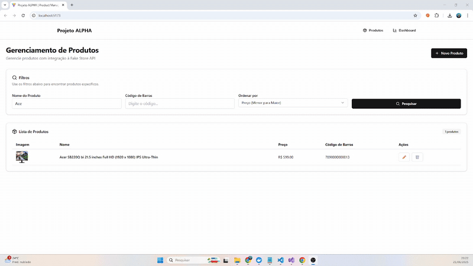

# 🔧 Alpha Manager API

API REST construída em **ASP.NET Core**, responsável pela gestão de produtos e integração com a **Fake Store API**.



✔️ Essa API serve como backend do projeto **Alpha Manager**, oferecendo CRUD completo, sincronização com dados externos e estruturada com **Clean Architecture** e **Entity Framework**.

---

## ✅ Features

- ✅ API RESTful para **gestão de produtos**
- ✅ Integração com a **Fake Store API**
- ✅ CRUD completo: criar, listar, filtrar, atualizar e excluir
- ✅ Filtros por nome, código de barras e ordenação por preço
- ✅ Paginação de resultados
- ✅ Validação de duplicidade por código de barras
- ✅ Armazenamento de imagem como string base64 (ou URL)
- ✅ Logs, tratamento de erros e exceptions amigáveis
- ✅ Arquitetura em camadas com **Clean Architecture**

---

## 🧱 Arquitetura do Projeto


alpha-manager-api/
├── Alpha.Api/ # Camada de apresentação (Controllers, Middlewares)
├── Alpha.Application/ # Casos de uso (Commands, Queries, Handlers)
├── Alpha.Domain/ # Entidades e Interfaces (core domain)
├── Alpha.Persistence/ # Acesso a dados (EF Core, Repositórios, Migrations)
├── Alpha.Persistences.FakeStoreService/ # Integração externa com Fake Store API

CQRS — Command Query Responsibility Segregation
CQRS separa as operações de leitura (Query) das operações de escrita (Command).

Command: operações que alteram o estado da aplicação.
➡️ Ex.: CreateProductCommand, UpdateProductCommand, DeleteProductCommand.

Query: operações que apenas consultam dados, sem alterar.
➡️ Ex.: GetProductByIdQuery, GetProductsQuery.

Benefícios do CQRS:
Código mais limpo e organizado

Cada operação tem uma responsabilidade única

Fácil manutenção de regras de negócio isoladamente


---

## ⚙️ Tecnologias Utilizadas

| Camada         | Tecnologias                                      |
|----------------|--------------------------------------------------|
| Framework      | ASP.NET Core 9                                  |
| ORM            | Entity Framework Core + PostgreSQL               |
| Integração API | HTTPClient para Fake Store API                   |
| Design Pattern | Clean Architecture + CQRS + Mediator (MediatR)   |
| Documentação   | Swagger / Swashbuckle                            |
| Logs           | ILogger                                          |
| Validação      | FluentValidation (opcional)                      |
| Deploy         | Docker (opcional)                                |

---

## 🚀 Rotas Disponíveis

| Método | Rota                                     | Descrição                                     |
|--------|-------------------------------------------|------------------------------------------------|
| GET    | `/api/v1/products`                       | Lista produtos com filtros e paginação         |
| GET    | `/api/v1/products/{id}`                  | Busca produto por ID                           |
| POST   | `/api/v1/products`                       | Cria um novo produto                           |
| PUT    | `/api/v1/products/{id}`                  | Atualiza um produto                            |
| DELETE | `/api/v1/products/{id}`                  | Exclui um produto                              |
| POST   | `/api/v1/products/sync-fakestore`        | Sincroniza produtos da Fake Store para o banco |

---

## 🔗 Integração com Fake Store API

✔️ A sincronização ocorre no backend:

- Rota: `/api/v1/products/sync-fakestore`
- Dados são buscados de [`https://fakestoreapi.com/products`](https://fakestoreapi.com/)
- Produtos são inseridos no banco, evitando duplicações via código de barras

---

## 📦 Instalação

### 🔧 Pré-requisitos

- [.NET SDK 9](https://dotnet.microsoft.com/en-us/download)
- [PostgreSQL](https://www.postgresql.org/) rodando localmente ou remoto
- Editor: Visual Studio, VS Code, Rider ou outro

---

### 🚚 Clonar o projeto

```bash
git clone https://github.com/seu-usuario/alpha-manager-api.git
cd alpha-manager-api


🔗 Configurar appsettings.json

{
  "ConnectionStrings": {
    "DefaultConnection": "Host=localhost;Port=5432;Database=AlphaDb;Username=postgres;Password=suasenha"
  },
  "Logging": {
    "LogLevel": {
      "Default": "Information"
    }
  },
  "AllowedHosts": "*"
}

🏗️ Rodar as migrations
dotnet ef database update

▶️ Executar a API
dotnet run --project Alpha.Api

A API estará disponível em:
👉 https://localhost:44356/swagger

🧠 Observações Importantes
✔️ As imagens são armazenadas como base64 ou URL na coluna ImageBytes.

✔️ O código de barras é gerado como 789000000000X para garantir unicidade.

✔️ Se já existir um produto com determinado código de barras, ele não será duplicado na sincronização.


✅ Criar Produto
http
POST /api/v1/products
Payload:

json
{
  "name": "Monitor UltraWide",
  "price": 999.90,
  "barcode": "7891234567890",
  "imageBytes": "https://via.placeholder.com/150"
}
🛠️ Desenvolvimento com Docker (Opcional)
docker-compose up --build
Cria o container da API + banco PostgreSQL.

📄 Licença
MIT — Utilize, modifique e distribua livremente.

✨ Créditos
Desenvolvido por [Eudes Gomes] 🚀
Backend com 💙 usando ASP.NET Core + PostgreSQL + Clean Architecture


